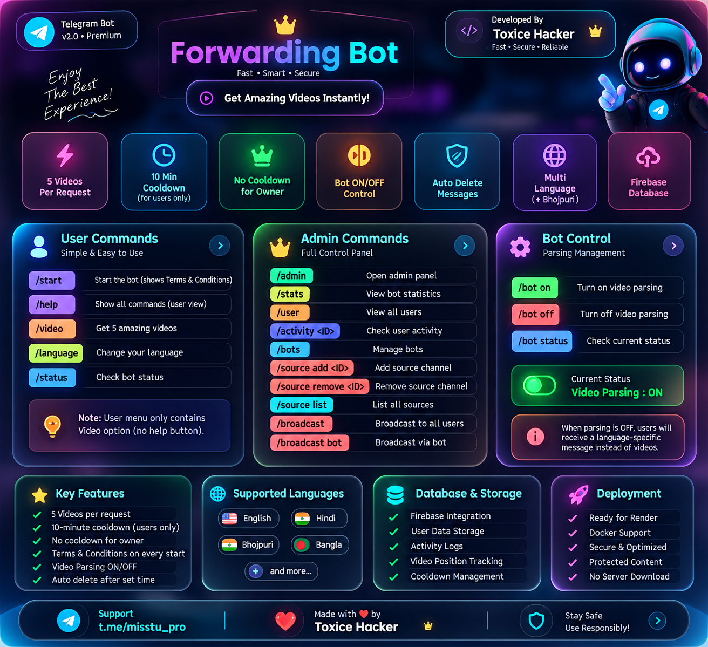

<div align="center">



# ✦ Forwarding Bot

### `Modern • Fast • Secure • Multi-Language`

**Developed by Toxice Hacker**

</div>

---

## 🧊 Premium UI

> Modern glassmorphism interface with soft shadows, blur effects, smooth visual styling and a clean Telegram-focused experience.

<div align="center">

`🎬 Video Parsing`　`👑 Admin Control`　`🌐 Multi-Language`　`💾 Firebase`

</div>

---

## 🎬 User Features

| Feature | Details |
|---|---|
| 🎬 **Video File** | Request videos from configured sources |
| 📦 **5 Videos** | 5 videos per normal request |
| ⏱️ **Cooldown** | 10-minute cooldown for normal users |
| 👑 **Owner Access** | Owner has no cooldown |
| 📜 **Terms & Conditions** | User must agree before using the video feature |
| 🔄 **Progress** | User video position is saved |
| 🌐 **Language** | Selectable multi-language interface |
| 🇮🇳 **Bhojpuri** | Supported |
| 🧹 **Auto Delete** | Automatic cleanup when configured |
| 🛡️ **Protected Content** | Protected sending mode supported |

---

## 👑 Admin Commands

```text
/admin
```
Open the premium Admin Panel.

```text
/help
```
Show the complete admin command guide.

```text
/stats
```
View users, requests, videos, sources and bot statistics.

```text
/user
```
View registered users.

```text
/activity USER_ID
```
View activity and request information for a specific user.

```text
/bots
```
View bot information.

---

## 📢 Broadcast

```text
/broadcast
```
Broadcast a replied message to registered users.

```text
/broadcast bot
```
Broadcast using the bot broadcast command.

---

## 📂 Source Management

```text
/source add CHAT_ID TITLE
```
Add a video source.

```text
/source remove CHAT_ID
```
Remove a source.

```text
/source list
```
View configured sources.

---

## 🎛️ Video Parsing Control

```text
/bot on
```
Enable Video Parsing.

```text
/bot off
```
Disable Video Parsing.

```text
/bot status
```
Check the current Video Parsing status.

### 🔴 When Video Parsing is OFF

Users receive **no videos**.  
They receive a localized message explaining that the owner has stopped Video Parsing and that it needs to be enabled again.

---

## 🌐 Languages

The bot supports a broad selection of languages, including:

**Hindi • Bhojpuri • English • Bengali • Telugu • Marathi • Tamil • Gujarati • Urdu • Kannada • Malayalam • Punjabi • Assamese • Maithili • Sanskrit • Nepali • Konkani • Sindhi • Dogri • Kashmiri • Manipuri • Bodo • Santali • Odia • Russian • Chinese • Japanese • Spanish • French • German • Portuguese • Arabic • Turkish • Indonesian • Vietnamese • Korean • Italian • Dutch • Polish • Ukrainian • Persian • Thai**

User-facing status and system messages follow the selected language where translations are available.

---

## 💾 Data & Persistence

- Firebase user data
- User consent
- Selected language
- Request statistics
- Video statistics
- Saved video position
- Cooldown state
- Activity history
- Source configuration
- Broadcast statistics
- Video Parsing ON/OFF state

---

## ⚡ Quick Feature Summary

```text
🎬 5 Videos / Normal Request
⏱️ 10-Minute User Cooldown
👑 No Cooldown for Owner
📜 Terms Required Before Video Access
🔴 Video Parsing ON / OFF
🌐 Multi-Language
🇮🇳 Bhojpuri
👤 Profile Welcome
💾 Firebase Persistence
📊 Statistics
👥 User Management
🔎 Activity Tracking
📢 Broadcast
📂 Source Management
🧹 Auto Delete
🛡️ Protected Content
🚀 Render Ready
🐳 Docker Ready
```

---

<div align="center">

### 🧊 Toxice Hacker

`Premium Telegram Bot Interface`

**Fast • Clean • Modern • Glassmorphism**

</div>
